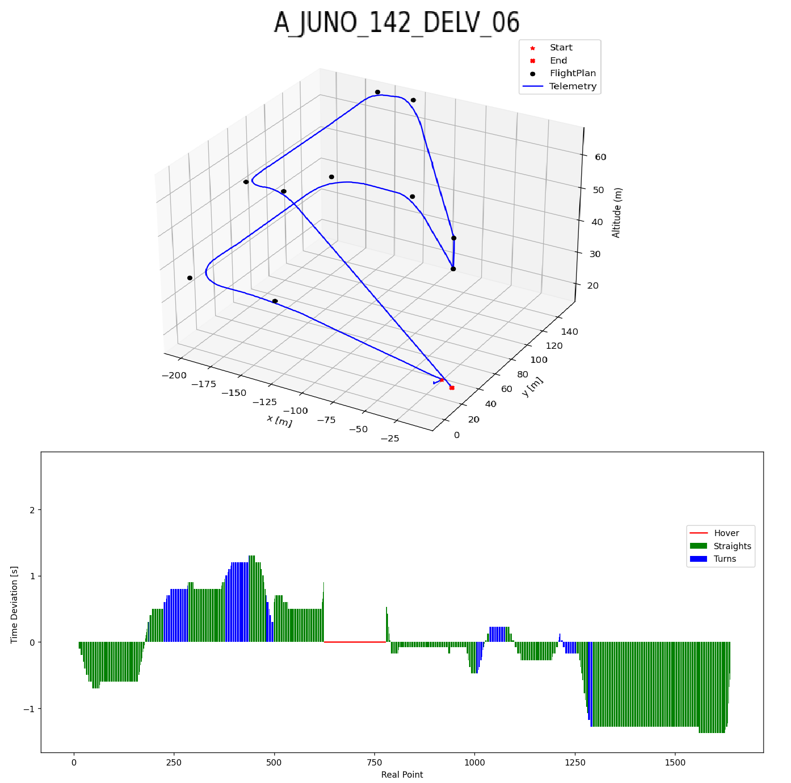

# Drone Flight Simulator

A Python-based simulator that models a drone’s realistic trajectory following a given flight plan with smooth turns.

---

## 📋 Description

This project computes the path a drone would take between a series of waypoints, automatically adjusting turns using a configurable turn radius. The core of this simulator is its ability to model acceleration and deceleration based on turn curvature, producing realistic speed and position profiles throughout the flight.

---

## ⚙️ Key Features

- Precise turn simulation with adjustable turn radii  
- Dynamic acceleration/deceleration modeling during turns  
- Discrete output of position, velocity, and acceleration at configurable time intervals  
- Telemetry‑comparison tool: simulated vs. real  
- Validated against 50+ real drone flight paths, with a maximum time deviation of 8 seconds for flights longer than 3 minutes  

---

## 🔮 Future Improvements

- Add additional drone parameters (mass, aerodynamics, wind, vertical acceleration/deceleration)  
- Generate drone‑specific flight profiles based on real turn behavior  
- Optimize trajectories for reduced energy consumption or shorter flight time  

---

## 📺 Simulation Example 
Route Overview and Time Deviation between RealTelemetry & Simulated
- Link Real Time Simulation: https://youtu.be/22to6lWYYkI?si=6rfrAwKVQOrS-PPw

